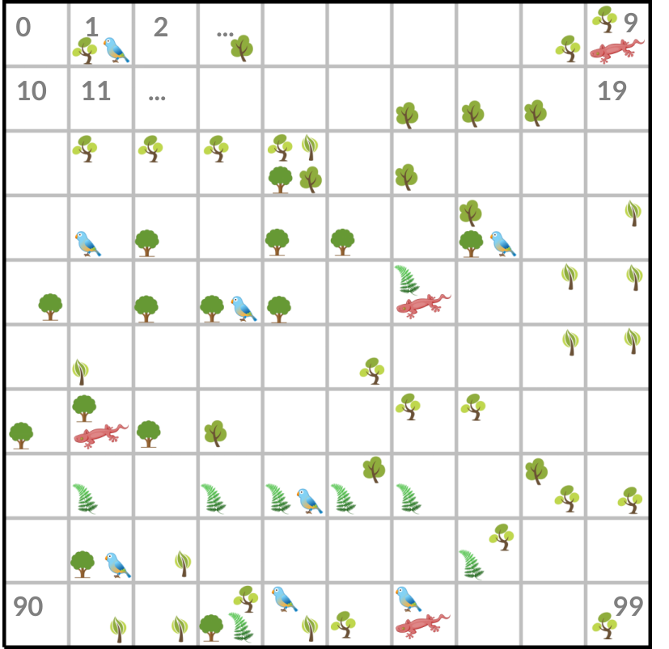

# TP Conservation Planning

Dans ce TP, l'objectif sera d'identifier des zones prioritaires pour la conservation de la biodiversité.
Le cas d'étude proposé (fictif), est une zone dans laquelle se trouvent 7 espèces menacées (5 espèces végétales et 2 espèces animales).
L'espace géographique dans lequel sont réparties ces espèces est ramené à une grille carrée régulière de dimensions
10x10. Chaque cellule de cette grille correspond à une unité de planification, qui peut être sélectionnée pour
faire partie de l'aire protégée.

Ces unités de planification sont indexées de 0 à 99, du coin en haut à gauche vers le coin en bas à droite.
L'index d'une cellule peut s'obtenir avec l'opération suivante : `i = row * W + col`, où `W` correspond à la largeur de
la grille (ici 10), et où `row` et `col` correspondent respectivement à la ligne et à la colonne sur laquelle se trouve
l'unité de planification. Cette grille est représentée ci-dessous :

Pour répondre à cette problématique, nous nous appuyerons sur le solver Choco (Programmation
par Contraintes). Pour réaliser ce TP, vous avez donc besoin de:

- Java >= 11
- Maven

Le projet est organisé de la manière suivante:

- `TP/ConservationPlanningModel.java`: notre modèle de base pour la planification de la conservation,
il contient différentes méthodes que vous devrez implémenter au fur et à mesure du TP (celles avec `// TODO`).
- `TP/Data.java`: les données d'occurrence des espèces à protéger.
- `TP/Step[1-5].java`: les méthodes principales à lancer, à chaque étape du TP.

### Etape 1

Dans cette étape, l'objectif est de construire le modèle de base, c'est à un modèle qui nous assure qu'une
solution à notre problème permet bien de sélectionner une aire protégée, et que dans cette aire nous pouvons
contrôler le nombre d'espèces présente dans l'aire protégée.

### Etape 2

Dans cette étape, nous enrichissons notre modèle de base pour identifier une aire protégée qui permet de couvrir toutes les
espèces.

### Etape 3

Dans cette étape, nous cherchons à identifier une aire protégée qui couvre toutes les espèces, à coût minimal (ici le coût correspond à la surface).

### Etape 4

Dans cette étape, nous cherchons à identifier une aire protégée qui couvre toutes les espèces, à coût minimal, et pour laquelle on doit
avoir au moins 2 occurrences pour les deux espèces animales.

### Etape 5

Finalement, nous cherchons à identifier une aire protégée qui respecte les même critères qu'à l'étape 4, mais cette fois-ci
l'aire protégée doit être connectée.